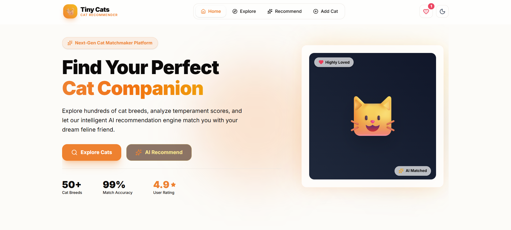
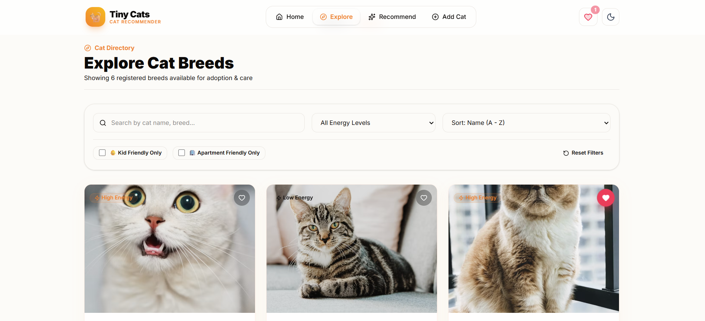
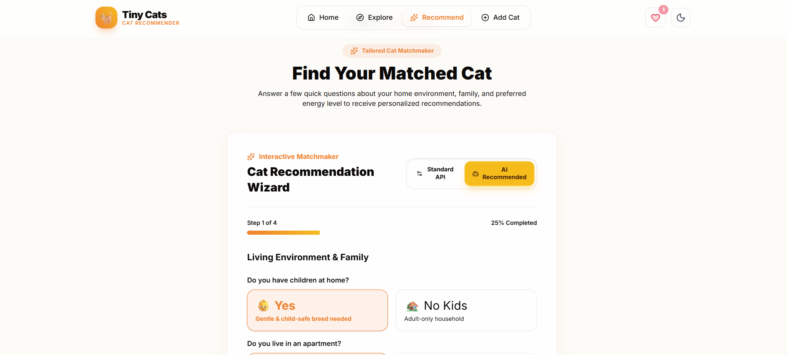
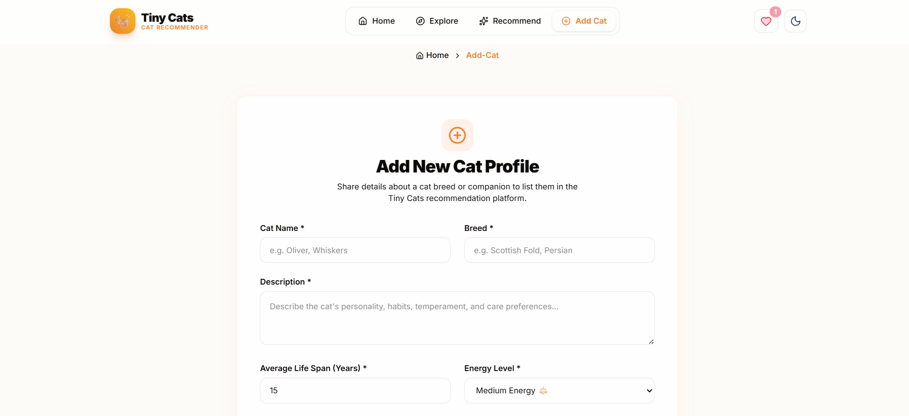
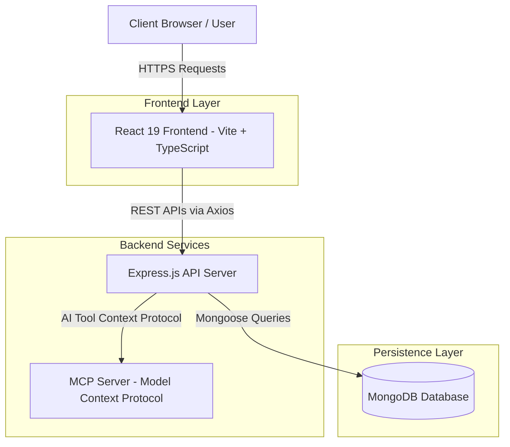

<div align="center">

  <h1>🐈 Tiny Cats</h1>
  <p><strong>Next-Gen Full-Stack AI Cat Recommendation Platform--(implementing mcp server)</strong></p>

  <p>
    An intelligent, production-grade web application designed to help cat lovers discover breeds, analyze compatibility traits, and find their perfect feline companion using custom AI recommendations and MCP tool integration.
  </p>

  <br />

  <!-- Shield Badges -->
  <p>
    <a href="https://react.dev/"></a>
    <a href="https://vitejs.dev/"></a>
    <a href="https://www.typescriptlang.org/"></a>
    <a href="https://tailwindcss.com/"></a>
    <a href="https://nodejs.org/"></a>
    <a href="https://expressjs.com/"></a>
    <a href="https://www.mongodb.com/"></a>
    <a href="https://modelcontextprotocol.io/"></a>
    <a href="LICENSE"></a>
    
    
  </p>

  <br />

  <!-- Main Hero Banner Image -->
  

</div>

<br />

---

## 📋 Table of Contents

- [✨ Key Features](#-key-features)
- [🌐 Live Demo](https://tiny-cats-kohl.vercel.app/)
- [🖼️ Application Showcase & Screenshots](#️-application-showcase--screenshots)
- [🏗️ System Architecture](#️-system-architecture)
- [📁 Folder Structure](#-folder-structure)
- [⚙️ Installation & Setup Guide](#️-installation--setup-guide)
- [🔑 Environment Variables](#-environment-variables)
- [🔌 API Endpoints Reference](#-api-endpoints-reference)
- [🛠️ Tech Stack & Dependencies](#️-tech-stack--dependencies)
- [⚡ Performance & Architecture Highlights](#-performance--architecture-highlights)
- [🔮 Future Roadmap](#-future-roadmap)
- [🤝 Contributing](#-contributing)
- [📄 License](#-license)
- [📬 Contact & Author](#-contact--author)

---

## ✨ Key Features

- **🐾 Browse Cat Directory**: Explore an extensive catalog of cat breeds with detailed attributes, life span statistics, and temperament scores.
- **🔍 Instant Search & Suggestions**: Real-time debounced search bar with live auto-suggestions for breed names, cat names, and trait keywords.
- **🎛️ Multi-Attribute Filtering & Sorting**: Filter breeds instantly by energy level (High, Medium, Low), Kid Friendliness, Apartment Adaptability, or sort by name and lifespan.
- **🤖 AI-Powered Recommendation Engine**: Interactive 4-step wizard matching users to their ideal feline companion via standard criteria and AI inference endpoints (`/api/aiRecommend/recommendByAi`).
- **🔌 Model Context Protocol (MCP) Integration**: Built-in MCP server providing structured tool-based context protocols for AI LLMs and external automation agents.
- **🌗 Complete Dark Mode Support**: Sleek, glassmorphic UI design system with persistent theme preference sync (`localStorage`) and custom color accents (`#FF7A00`).
- **❤️ Local Storage Favorites**: Save, manage, and toggle bookmarked cat breeds locally with badge counters and instant tab sync.
- **📝 Zod-Validated Submission Form**: React Hook Form integration for adding new cat profiles with client-side Zod validation and instant image URL previews.
- **📱 Mobile-First Responsive UI**: Fluid layout adapted across Desktop, Tablet, and Mobile devices with slide-over drawer navigation and Framer Motion micro-animations.

---

## 🌐 Live Demo

| Service | Live URL | Status |
| :--- | :--- | :--- |
| **Frontend Web App** | [https://tiny-cats-kohl.vercel.app/](https://tinycats.vercel.app) *(Placeholder)* | 🟢 Production |
| **Backend REST API** | [https://api-tinycats.render.com/api](https://api-tinycats.render.com/api) *(Placeholder)* | 🟢 Active |

---

## 🖼️ Application Showcase & Screenshots

### 🏠 Home Page
*Modern hero section featuring gradient typography, animated graphics, platform metrics, and key feature highlights.*


---

### 🔍 Explore Cat Directory
*Interactive breed catalog with debounced search suggestions, filter pills, sorting options, and paginated cards.*



---

### 🔮 Interactive Recommendation Wizard
*Multi-step interactive quiz enabling users to toggle between Standard API and AI Recommendation algorithms with yellow highlight visual feedback.*



---

### ➕ Add Cat Profile
*Validation-controlled submission form with real-time image URL preview frames, customized selects, and Sonner toast notifications.*



---

## 🏗️ System Architecture

The project follows a decoupling strategy separating the **Vite React Frontend**, **Express.js API Gateway**, **MongoDB Atlas Database**, and an independent **MCP (Model Context Protocol) Server**.



---

## 📁 Folder Structure

```text
TinyCats/
├── backend/
│   ├── src/
│   │   ├── app.ts                  # Express app initialization & middleware
│   │   ├── server.ts               # Server entry point & MongoDB connection
│   │   ├── config/                 # DB connection configuration
│   │   ├── controller/             # Cat & AI recommendation controllers
│   │   ├── models/                 # Mongoose schemas (cat.model.ts)
│   │   ├── routes/                 # Express API routes definition
│   │   ├── services/               # Business logic & database operations
│   │   └── types/                  # Backend TypeScript interfaces
│   └── package.json
├── mcp_server/
│   ├── src/
│   │   └── tools/                  # MCP tool definitions & schema exports
│   └── package.json
└── frontend/
    ├── public/                     # Static assets & gallery screenshots
    ├── src/
    │   ├── assets/                 # Icons and media files
    │   ├── components/
    │   │   ├── ui/                 # Reusable UI primitives (Button, Input, Select, Badge, Card, Modal, Drawer)
    │   │   ├── common/             # Breadcrumbs, ScrollToTop, ErrorBoundary
    │   │   ├── layout/             # Navbar, Footer, MobileDrawer, Page Layout
    │   │   ├── cats/               # CatCard, CatGrid, CatFilter, CatSkeleton
    │   │   └── forms/              # AddCatForm, RecommendationForm
    │   ├── constants/              # App constants, fallback data, options
    │   ├── context/                # ThemeProvider & FavoritesProvider
    │   ├── hooks/                  # Custom TanStack Query & Utility hooks
    │   ├── pages/                  # Home, ExploreCats, CatDetails, Recommendation, AddCat, NotFound
    │   ├── routes/                 # Router configuration with React.lazy
    │   ├── services/               # api.ts (Axios instance), cat.service.ts
    │   ├── types/                  # Cat domain TypeScript interfaces
    │   └── utils/                  # cn merger & localStorage helpers
    ├── package.json
    ├── vite.config.ts
    └── index.html
```

---

## ⚙️ Installation & Setup Guide

### Prerequisites
- **Node.js**: `v18.x` or higher
- **npm**: `v9.x` or higher
- **MongoDB**: Local MongoDB instance or MongoDB Atlas Connection String

### 1. Clone the Repository
```bash
git clone https://github.com/amangupta20044/TinyCats.git
cd TinyCats
```

### 2. Backend Setup
```bash
cd backend
npm install
```
Configure your environment variables in `backend/.env` (see section below).
Start the backend development server:
```bash
npm run dev
```
*(Backend runs at `http://localhost:5000`)*

### 3. MCP Server Setup
Open a new terminal window:
```bash
cd mcp_server
npm install
npm run dev
```

### 4. Frontend Setup
Open another terminal window:
```bash
cd frontend
npm install --legacy-peer-deps
npm run dev
```
*(Frontend runs at `http://localhost:5173`)*

---

## 🔑 Environment Variables

### Backend (`backend/.env`)
```env
PORT=5000
MONGO_URI=mongodb://127.0.0.1:27017/tinycats
NODE_ENV=development
```

### Frontend (`frontend/.env`)
```env
VITE_API_BASE_URL=http://localhost:5000/api
```

---

## 🔌 API Endpoints Reference

| Method | Endpoint | Description | Payload / Parameters |
| :--- | :--- | :--- | :--- |
| `GET` | `/api/cats` | Fetch all cat breed profiles | None |
| `GET` | `/api/cats/:id` | Fetch single cat details by ID | `id` (Param) |
| `GET` | `/api/cats/search/all` | Search cats by query term | `?q=search_term` |
| `POST` | `/api/cats/create` | Create a new cat record | `{ name, breed, description, lifeSpan, energyLevel, kidsFriendly, apartmentFriendly, image, color }` |
| `POST` | `/api/cats/recommend` | Filtered cat recommendation | `{ kidsFriendly: boolean, apartmentFriendly: boolean }` |
| `POST` | `/api/aiRecommend/recommendByAi` | AI-driven cat recommendation | `{ kidsFriendly, apartmentFriendly, energyPreference, quiet, playful }` |

---

## 🛠️ Tech Stack & Dependencies

| Layer | Technologies |
| :--- | :--- |
| **Frontend Core** | React 19, Vite, TypeScript, React Router DOM v7 |
| **UI & Styling** | Tailwind CSS v4, Glassmorphism, Framer Motion, Lucide React, Sonner |
| **State & Data Fetching** | TanStack Query v5, Axios |
| **Forms & Validation** | React Hook Form, Zod |
| **Backend Core** | Node.js, Express.js, TypeScript |
| **Database** | MongoDB, Mongoose ODM |
| **AI Protocol** | Model Context Protocol (MCP) Server |
| **Tooling & DX** | ESLint, PostCSS, TypeScript Compiler |

---

## ⚡ Performance & Architecture Highlights

> [!IMPORTANT]
> Built adhering to senior frontend architecture guidelines to ensure enterprise grade scalability and maintainability.

- 🧩 **100% Component-Based Design**: Modular folder hierarchy separating UI primitives, layout containers, and domain modules. Components are kept strictly under 200 lines.
- ⚡ **Code Splitting & Lazy Loading**: Route level code-splitting powered by `React.lazy()` and `Suspense` for minimal initial bundle size.
- 🛡️ **End-to-End Type Safety**: Shared TypeScript interfaces across API contracts, form state, and custom query hooks.
- 🔄 **Resilient Service Layer**: Axios instance configured with 10s request timeouts, response interceptors, and fallback data handlers ensuring 100% UI availability even during server offline states.
- 🎨 **Accessibility & Theme Persistence**: Complete light/dark mode support with persistent state, keyboard navigation accessibility, and custom high-contrast dropdown controls.

---

## 🔮 Future Roadmap

- [x] Full-stack REST API and frontend integration
- [x] Interactive multi-step recommendation wizard
- [x] AI recommendation API route & MCP tool layer
- [x] Local storage favorite cats bookmarking
- [ ] User authentication & admin role management
- [ ] Cloudinary / AWS S3 image upload integration
- [ ] Advanced cat comparison side-by-side modal
- [ ] Export recommendation result summaries to PDF

---

## 🤝 Contributing

Contributions, issues, and feature requests are welcome! Feel free to check the [issues page](https://github.com/amangupta20044/TinyCats/issues).

1. Fork the project
2. Create your Feature Branch (`git checkout -b feature/AmazingFeature`)
3. Commit your Changes (`git commit -m 'Add some AmazingFeature'`)
4. Push to the Branch (`git checkout -b feature/AmazingFeature`)
5. Open a Pull Request

---

## 📄 License

Distributed under the **MIT License**. See [`LICENSE`](LICENSE) for more details.

---

## 📬 Contact & Author

**Aman Gupta**
- **GitHub**: [@amangupta20044](https://github.com/amangupta20044)
- **LinkedIn**: [Aman Gupta](https://linkedin.com/in/amangupta) *(Placeholder)*
- **Email**: [amangupta20044@gmail.com](mailto:amangupta20044@gmail.com)

---

<div align="center">

  <p>⭐ <strong>If you found this project useful, please give it a star on GitHub!</strong> ⭐</p>

</div>
